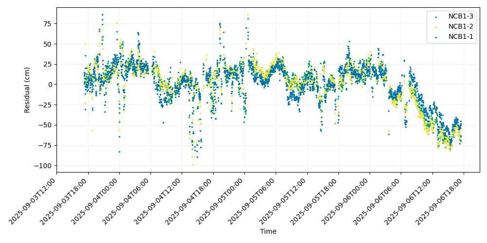
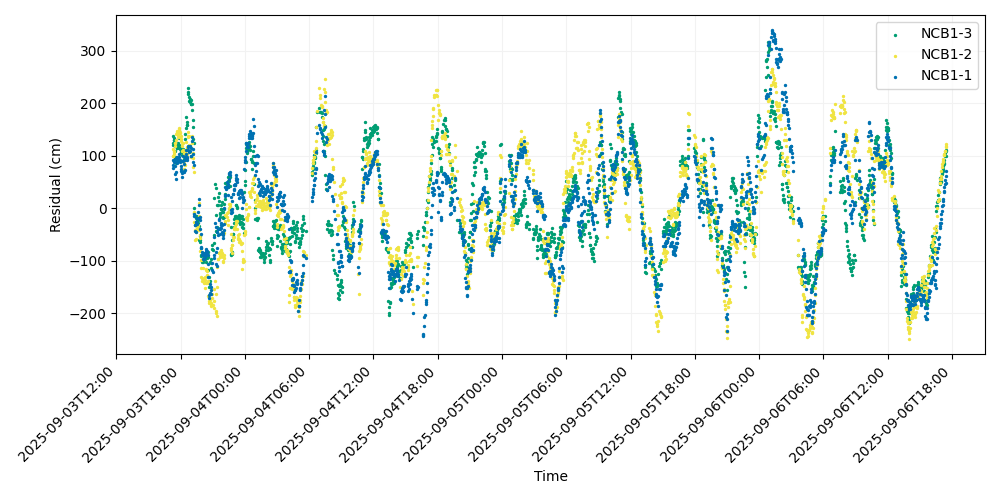

# "Real-time" Processing

## Context

GNSS-Acoustic measurements require significant resources in order to procure since it can take 3-5 days of surveying to collect enough data to resolve a single array position. Time at sea is valuable, even despite the reduced operating costs of the Wave Glider, and the data quality of a GNSS-Acoustic survey is impacted by the conditions on site during data collection. For example, inclement weather can lead to increased sea states that degrade the data quality of the GNSS positioning and acoustic ranging. A common question for survey operators is when enough data has been collected at a site to generate an adequately constrained array position, but this cannot be properly assessed without analyzing the data themselves. Thus, it is good practice to generate a preliminary positioning solution during a survey in order to verify that the data are of sufficient quality to generate an accurate array position. This is done with data telemetered to shore from the Wave Glider, typically via the Iridium satellite network.

While it may be tempting to call this a "real-time solution", there are key differences that prevent it from being analogous to a real-time kinematic GNSS solution. Currently, the LRI model SV-3 Wave Gliders connect to RUDICS once every six minutes, and only data sampled at a reduced rate of one record per 2 minutes may be telemetered to shore. This is nearly an order of magnitude fewer pings than the full data set contains, which greatly increases the uncertainty of any real-time solution. Furthermore, the INS records are also sampled at two minutes rather than the 20 Hz sampling rate for platform velocities/orientations and 1 Hz for RINEX samples, which means it is much more difficult to precisely locate the transducer at ping send and reply. As a result, this solution is typically sufficient for only QC purposes barring exceptional circumstances such as a coseismic offset at the field site.

Because the data telemetered to shore have been parsed at a 2-minute sampling rate, we colloquially refer to it as a "parsed" data set and the solution as a "parsed" solution.

## Processing Adjustments

The standard posfilter processing will fail outright when attempted on a parsed data set due to the reduced sampling rate of the INS - the Kalman filter and spline interpolation require the full-rate data. The Wave Glider telemeters a real-time solution for the antenna position at each ping interrogation and reply, but while the ping interrogation is timed to match a position the replies are only timed to the closest preceding 0.2 second increment. Furthermore, the position itself is not the most accurate since it is a psuedorange solution. However, these are the best data we have available so we use them to infer the antenna position over time. More precisely, we assume that the *position offset* between ping interrogation and reply is reasonably accurate and can be used to infer the antenna positions to the best of our ability given the available data. The parsed pre-processing procedure can be then described as:

1. Download and extract the 2-minute parsed data from the Wave Glider.
2. Assemble the 2-minute parsed RANGEA strings from the Wave Glider data and convert it to RINEX. Generate a kinematic solution from these data using a software of your choice. This corresponds to a time series of antenna positions at ping interrogation.
3. Infer the antenna positions at ping reply by adding the antenna offset between interrogate and reply as measured on board the Wave Glider to the position at ping interrogate calculated in step 2.
4. Assemble a time series of Wave Glider orientations at ping interrogate and (approximate) ping reply using the data telemetered to shore.
5. Rotate the positions from the antenna to the transducer using the procedure outlined in the [_GNSS-A Pre-Processing Overview_](./gnssa_preprocessing.md#antenna-transducer-rotation).
6. From here, an array position can be calculated using the GNATSS solver.

## The GNATSS Parsed Module

GNATSS includes a module for the parsed processing described above, which can be invoked as an alternative to the standard posfilter module. The parsed module reads the _tar.gz_ files that contain the pin files with 2-minute parsed data and a processed kinematic GNSS solution of 2-minute sampled antenna positions, then infers the antenna positions at ping reply and rotates the antenna positions to track the transducer. Similar to the posfilter module, the parsed module exports the result to the [Community Standard GNSS-Acoustics Data Format](https://hal.science/hal-04319233/) that may be read as input for the GNATSS solver module.

In order to run the parsed module, first add the [Parsed configuration](config_yaml.md) to your configuration file. Because the parsed processing is not enabled by default, it must be manually invoked:

```
gnatss run --parsed --distance-limit 150 config.yaml
```

To run the parsed and solver modules in the same command, invoke:

```
gnatss run --parsed --solver --distance-limit 150 config.yaml
```

Just as with the posfilter module, once the parsed module has created L-2 data inputs it no longer needs to be called during further iterations of GNATSS.

An example of QC data processed with the `--parsed` option is shown below. These data were collected at the Seafloor Geodesy Community Experiment site NCB1 in Central Cascadia during the 2025 field campaign. The positions for this example were processed using the Canadian Spatial Reference System Precise Point Positioning ([CSRS-PPP](https://webapp.csrs-scrs.nrcan-rncan.gc.ca/geod/tools-outils/ppp.php?locale=en)) online tool.



### Note regarding RINEX files

GNATSS is not equipped to generate RINEX files from the RANGEA records logged in the pin files, so it is up to the user to extract the RANGEA records and convert them manually. In the case that you do not have processed positions as input for GNATSS, you may still run the `--parsed` command. The parsed module will default to using the pseudorange positions logged by the Wave Glider when processed positions are not provided. This is the parsed solution of the same data set generated by GNATSS using the real-time Wave Glider positions:



Comparing the two solutions, it is apparent that the solver performs much better with the manually processed antenna positions. Thus, we recommend manually processing the GNSS data whenever possible.