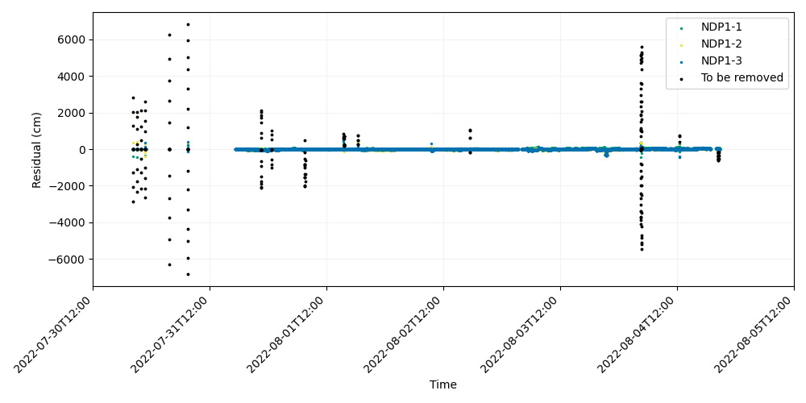
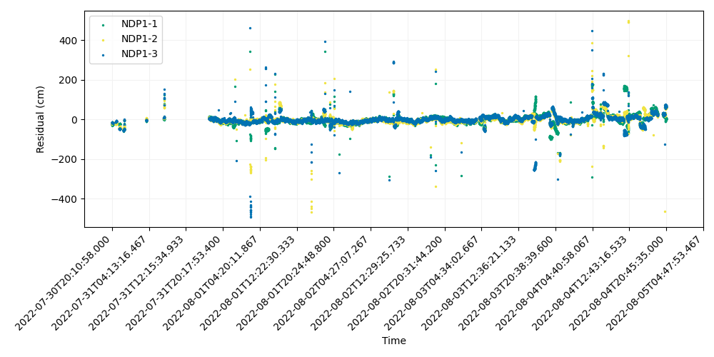
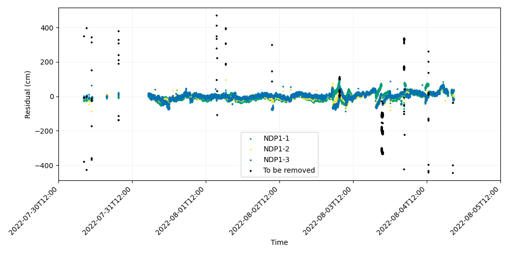
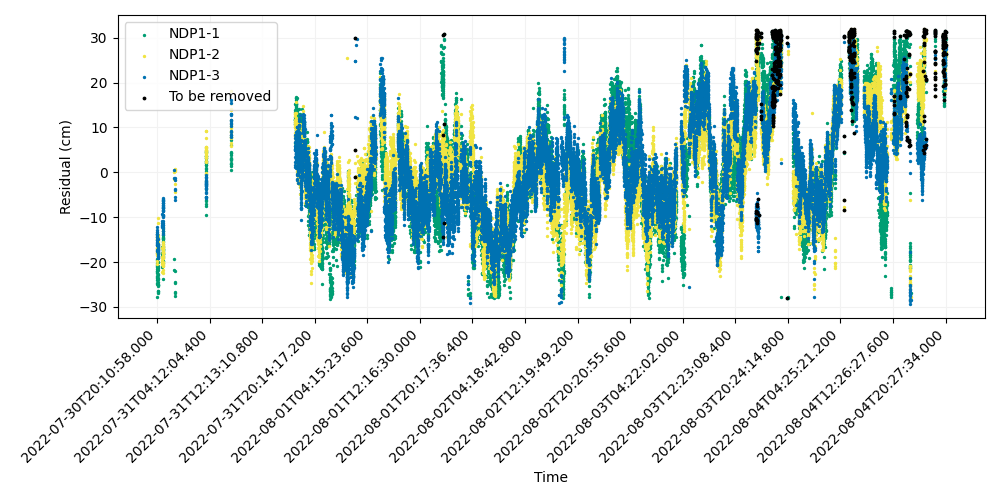
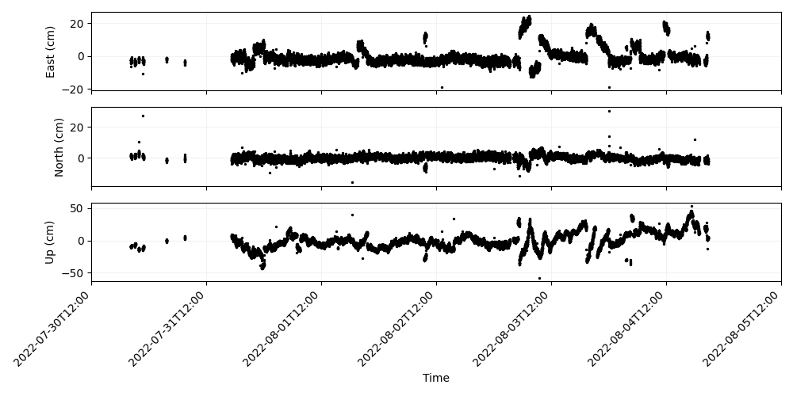
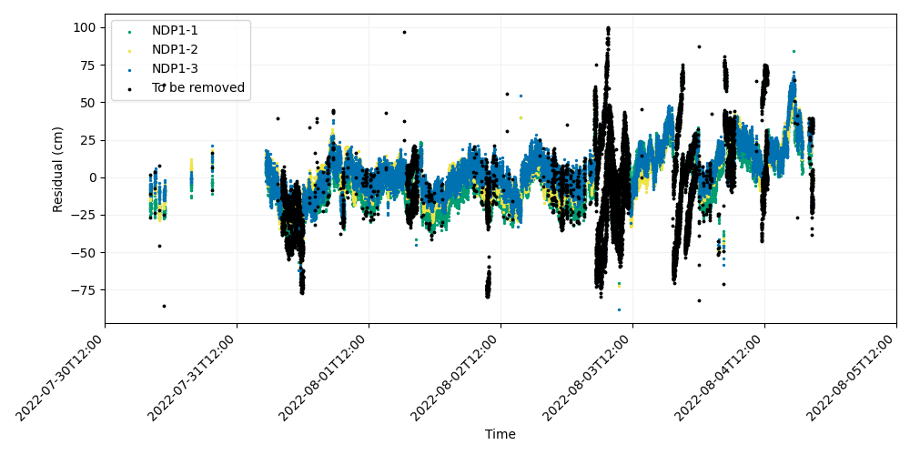
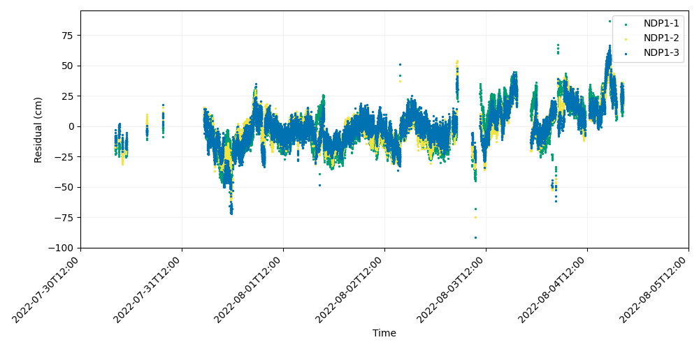
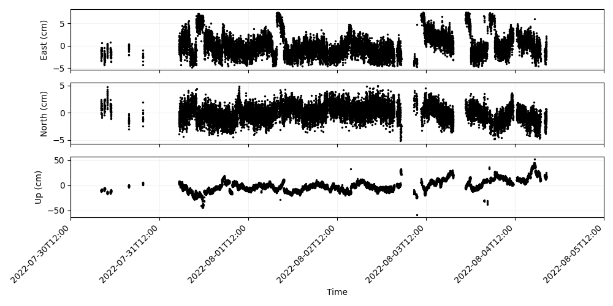

# GNATSS Example

## Setting up the initial run

The following example shows how to calculate an array position for a
GNSS-Acoustic survey using GNATSS. The data set we will demonstrate is the 2022
survey of the array NDP1 offshore Depoe Bay, OR, which was collected as part of
the Seafloor Geodesy Community experiment.

The first step is to prepare all of the input files required to calculate a
position, including the _pxp_tt_ file with acoustic two-way travel times, the
_gps_positions_ file with antenna positions, the Novatel files with #INSPVA and
#INSSTDEVA strings, and the sound velocity profile. Create a working directory
and place a configuration file inside of it. This configuration file may be
edited from the template available on the [GNATSS Config File](./config_yaml.md)
page or the [GNATSS GitHub](https://github.com/seafloor-geodesy/gnatss). You may
name this file whatever you like, but for the purposes of this example, we will
name the configuration file _NDP1_2022_config.yaml_. Edit
_NDP1_2022_config.yaml_ to reflect the a priori site information and locations
of the input data files. Once you have done this, run GNATSS in the working
directory with the following command on the command line interface:

```
gnatss run --distance-limit 150 NDP1_2022_config.yaml
```

After a successful run, GNATSS will generate an _output_ directory defined in
the configuration file, by default _./output_. The output directory will contain
the following files:

- `gps_solution.csv`: Input data file in the Community Standard GNSS-A format.
  This file is only generated when the user runs the _posfilter_ mode of GNATSS.
- `process_dataset.nc`: NetCDF file with array offsets.
- `residuals.csv`: File with the GNSS-Acoustic residuals, the difference between
  the measured and modeled two-way travel times for each ping. Residual values
  are converted to centimeters from seconds with the mean sound velocity.
- `deletions.csv`: File with a list of residuals with poor data quality, to be
  removed the next time gnatss is executed.
- `dist_center.csv`: File with the distances between the transducer and the
  center of the array for each ping.
- `outliers.csv`: File with residuals that fall outside a user-defined
  threshold. Concatenated to _deletions.csv_ the next time gnatss is executed.
- `residuals.png`: A plot of the acoustic residuals. There is one time series
  for each transponder in the array.
- `residuals_enu_components.png`: A plot of the acoustic residuals averaged
  together over space to estimate the apparent offset of the array center during
  each ping.

The above run executed both the posfilter and solver modes of GNATSS by default
since we did not specify an individual mode. Because of this, a
_gps_solution.csv_ file was generated in addition to the array position. If we
want to repeat the array positioning executed by the solver, we can skip the
posfilter mode by using this _gps_solution.csv_ file as input data.

A good way to assess the quality of the solution is to evaluate the
_residuals.png_ file. After running GNATSS the first time with the above
command, this plot shows the following:


In this example, we directed GNATSS to automatically flag and remove any pings
from the inversion during which the transducer was more than 150 m from the
center of the array with the "--distance-limit" option. However, the residuals
still appear to have some large outliers relative to the mean. Notably, the
large vertical spikes are likely errors due to GNSS cycle slips and are
significantly biasing the solution.

## Refining the solution

One of the strengths of GNATSS is that it can identify and flag outlier
residuals according to a user-defined threshold. Since the first run showed that
the vast majority of residuals were <500 cm from the mean, we will run GNATSS
again while setting the outlier threshold to 500. In this run, we no longer need
to run the posfilter mode since the _gps_solution.csv_ file was generated
previously. To take advantage of this, we can use the "--from-cache" flag, which
will direct GNATSS to skip the posfilter mode and look for the
_gps_solution.csv_ file in the output directory. We don't even need to update
the configuration file!

```
gnatss run --from-cache --distance-limit 150 --residual-limit 500 NDP1_2022_config.yaml
```

After doing this, you will notice that the solution itself has not changed.
However, if we open look a the residuals again, we can see that the vertical
spikes due to the GNSS cycle slips have been flagged.



All of the flagged residuals have been stored in the file _outliers.csv_. If we
run GNATSS with the "--remove-outliers" flag, this file will be concatenated to
the _deletions.csv_ file and the residuals removed from the inversion. If for
some reason you feel that too many residuals have been flagged, you can delete
_outliers.csv_ in order to unflag those residuals, or simply run GNATSS again
with a looser outlier threshold. Note that no data has been actually removed
from the input files, so if you feel that too much data has been concatenated to
the _deletions.csv_ file, you can delete it to start a fresh inversion.

In any case, now that we have some outliers flagged, we can now run GNATSS with
the "--remove-outliers" flag, which will direct it to automatically remove any
flagged residuals:

```
gnatss run --from-cache --distance-limit 150 --remove-outliers NDP1_2022_config.yaml
```

GNATSS has now removed the residuals that had been flagged during the previous
run.



There are still some outlier residuals, so let's try tightening the outlier
threshold. The strategy used to flag and remove residuals is up to the user's
discretion. In this case, there is a fairly consistent band of residuals near 0
cm that I interpret as the primary geodetic signal within the time series. I
choose a strict outlier threshold of 100 cm in order to isolate that signal.

```
gnatss run --from-cache --distance-limit 150 --residual-limit 100 NDP1_2022_config.yaml
```

This flags the following residuals:



Since I am satisfied that only outliers from the main time series are being
flagged, I lock in the deletions by running GNATSS again.

```
gnatss run --from-cache --distance-limit 150 --remove-outliers NDP1_2022_config.yaml
```

This generates the following residual plot:



There is a definitive cyclical signal within these residuals due to
oceanographic effects. However, the important thing to note is that all three
residual time series for the transponders are capturing similar signals from the
ocean and plotting on top of each other. Because of this, if we average the
residuals over space to estimate the offsets of the array center, we will see
that this cyclical signal mostly maps in to the vertical component and that the
horizontal offsets are pretty stable. This can be verified in the
_residuals_enu_components.png_ plot:



However, even though the apparent east and north positions are reasonably stable
there are some large excursions on 2022-08-03. It is unlikely that the array
moved many centimeters and then returned to its original position within the
span of a single day without triggering a seismic response, so it is likely this
signal is caused by our assumptions in the GNSS-A positioning briefly breaking
down. This could be due to oceanographic effects (such as from eddies) or errors
in the GNSS positions. Unfortunately, the poor residuals that occur during
2022-08-03 have a similar magnitude as many of the good residuals occurring
earlier in the data set, so if we naively set an outlier threshold as we have
previously done, we will risk flagging a volume of good data. To further refine
this solution, we will have to adopt a different strategy for flagging
residuals.

## Alternative Residual Flagging

GNATSS has an alternative method for flagging residuals, which is the
"--residual-range-limit" option. This option accepts a user-defined range in cm,
which defines a threshold for the maximum and minimum residuals for a given
ping. If the range, defined as the $\Delta a_{max}-\Delta a_{min}$, is greater
than the user-defined threshold, then the residuals for that ping will be
flagged for removal.

This works because of the underlying assumption in GNATSS processing that any
oceanographic variation must occur in the upper water column, where the acoustic
rays to each transponder in the array are close to one another when surveying
from the array center. If this assumption is true, each ray captures a similar
time delay due to the oceanographic generation so the residuals will be very
close. When this assumption starts to break down, the residuals will no longer
be close since they will be capturing different acoustic delays and so the
difference between the maximum and minimum residual increases. Oceanographic
phenomena that may cause these kinds of anisotropic delays include ocean
currents (particularly deep currents), eddies, or internal tides and waves, all
of which may cause horizontal gradients within the water column.

We can demonstrate this flagging strategy with the 2022 NDP1 data set we left in
the previous section. Starting from where we left off, having flagged residuals
that were >100 cm, we first observe the residuals and estimate how far outlier
replies are from replies received from the same ping. In this data set, it
appears that when the replies diverge from one another that they are separated
by >25 cm, so we will set this as our threshold:

```
gnatss run --from-cache --distance-limit 150 --residual-range-limit 25 NDP1_2022_config.yaml
```

This command will flag the following residuals:



Notice how this has flagged many of the poor residuals from before. Upon
removing them, we arrive at the following:



We can verify that this has removed many of the apparent excursions from the
average position with the ENU residual plot.



From here we can keep tuning the solution by flagging more residuals until we
are satisfied that we have removed many of the outliers that may bias the
solution. In general, a good strategy is to flag residuals conservatively so
that you don't accidentally remove good data. This is particularly important
after the first run of GNATSS, since very large (~1000s of cm) residuals can
bias the average position so much that the primary residual time series diverge.
However, if you remove only the largest residuals, the residuals will usually
converge. Because of this, it is also good practice to verify which residuals
you wish to flag and remove by looking at the residual plots beforehand.
