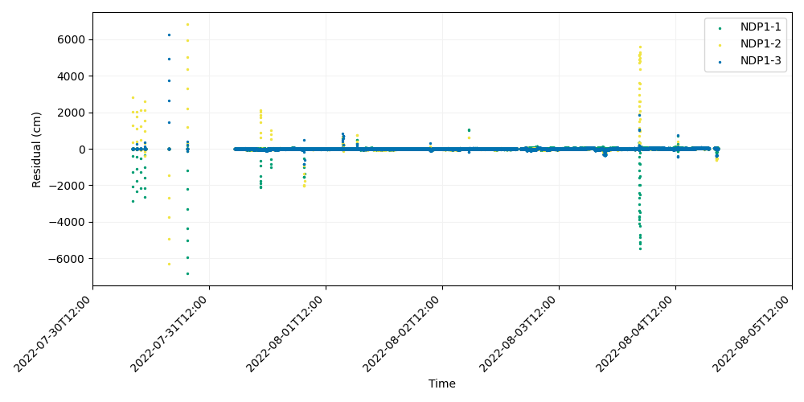
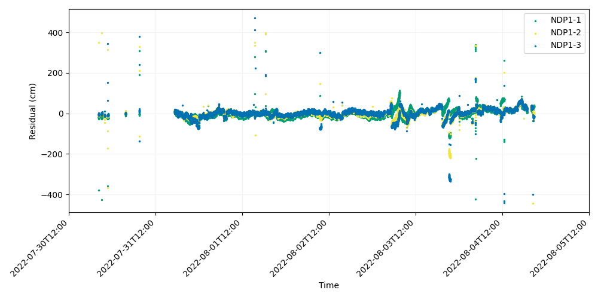
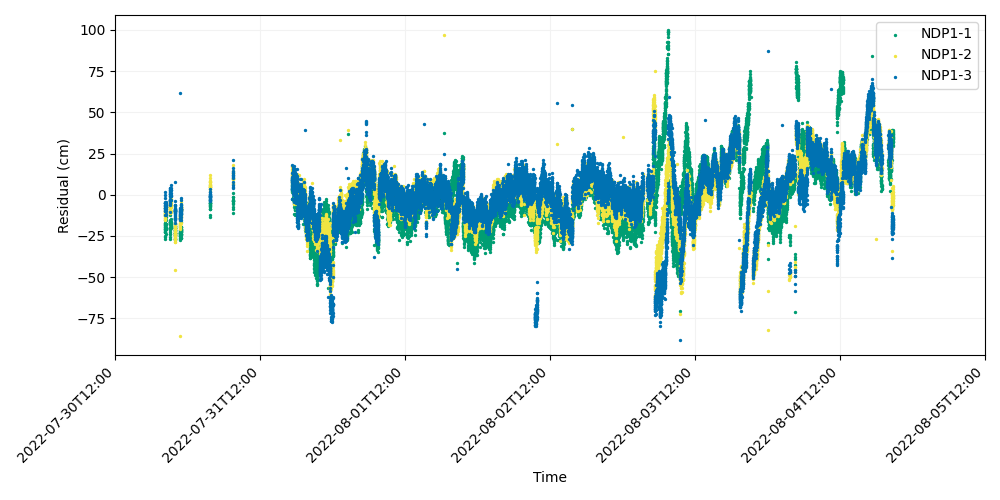

# GNATSS Example

## Setting up the initial run

The following example shows how to calculate an array position for a GNSS-Acoustic survey using GNATSS. The data set we will demonstrate is the 2022 survey of the array NDP1 offshore Depoe Bay, OR, which was collected as part of the Seafloor Geodesy Community experiment.

The first step is to prepare all of the input files required to calculate a position, including the *pxp_tt* file with acoustic two-way travel times, the *POS_FREED_TRANS_TWTT* file with transducer positions, and the sound velocity profile. Create a working directory and place a configuration file named *config.yaml* inside of it. Edit *config.yaml* to reflect the a priori site information and locations of the input data files. Once you have done this, run GNATSS in the working directory with the following command on the command line interface:

```
gnatss run --extract-dist-center --extract-process-dataset --qc --distance-limit 150
```

After a successful run, GNATSS will generate an *output* folder with the following files:

- *process_dataset.nc*: NetCDF file with array offsets.
- *residuals.csv*: File with the GNSS-Acoustic residuals, the difference between the measured and modelled two-way travel times for each ping. Residual values are converted to centimeters from seconds with the mean sound velocity.
- *deletions.csv*: File with a list of residuals with poor data quality, to be removed the next time gnatss is executed.
- *dist_center.csv*: File with the distances between the transducer and the center of the array for each ping.
- *outliers.csv*: File with residuals that fall outside a user-defined threshold. Concatenated to *deletions.csv* the next time gnatss is executed.
- *residuals.png*: A plot of the acoustic residuals. There is one time series for each transponder in the array.
- *residuals_enu_components.png*: A plot of the acoustic residuals averaged together over space to estimate the apparent offset of the array center during each ping.

A good way to assess the quality of the solution is to evaluate the *residuals.png* file. After running gnatss the first time with the above command, this plot shows the following:



In this example, we directed GNATSS to automatically flag and remove any pings from the inversion during which the transducer was more than 150 m from the center of the array with the "--distance-limit" option. However, the residuals still appear to have some large outliers relative to the mean. Notably, the large vertical spikes are likely errors due to GNSS cycle slips and are significantly biasing the solution.

## Refining the solution

One of the strengths of GNATSS is that it can identify and flag outlier residuals according to a user-defined threshold. Since the first run showed that the vast majority of residuals were <500 cm from the mean, we run gnatss again while setting the outlier threshold to 500:

```
gnatss run --extract-dist-center --extract-process-dataset --qc --distance-limit 150 --residual-limit 500
```

After doing this, you will notice that the solution itself has not changed. However, if we open look a the residuals again, we can see that the vertical spkies due to the GNSS cycle slips have been flagged.


All of the flagged residuals have been stored in the file *outliers.csv*. The next time we run gnatss, this file will be concatenated to the *deletions.csv* and the residuals removed from the inversion. If for some reason you feel that too many residuals have been flagged, you can delete *outliers.csv* in order to unflag those residuals so that you can run gnatss again with a loser outlier threshold. Note that no data has been actually removed from the input files, so if you feel that too much data has been concatenated to the *deletions.csv* file, you can delete it to start a fresh inversion.

In any case, now that we have some outliers flagged, we can now run gnatss again to remove them:

```
gnatss run --extract-dist-center --extract-process-dataset --qc --distance-limit 150 --residual-limit 500
```

Even though we have used the exact same command, gnatss will now generate a new solution since it has now removed the residuals that had been flagged during the previous run.



There are still some outlier residuals, so let's try tightening the outlier threshold. In this case, I choose a threshold of 30 cm.

```
gnatss run --extract-dist-center --extract-process-dataset --qc --distance-limit 150 --residual-limit 30
```

This flags the following residuals:


Since I am satisfied that only outliers from the main time series are being flagged, I lock in the deletions by running gnatss again and arrive at the following:



Notice how new residuals have been flagged! Since the final position is generated by averaging all of the residuals in the time series, outliers can bias the result. Because of this, when we removed the previous outliers, the mean position shifted enough that residuals just below the threshold were pushed beyond it. I choose to run gnatss a few more times in order to remove all of these residuals right at the threshold until no new residuals are flagged. The final residual plot looks like this:


There is a definitive cyclical signal within these residuals due to oceanographic effects. However, the important thing to note is that all three residual time series for the transponders are capturing similar signals from the ocean and plotting on top of each other. Because of this, if we average the residuals over space to estimate the offstes of the array center, we will see that this cyclical signal mostly maps in to the vertical component and that the horizontal offsets are pretty stable. This can be verified in the *residuals_enu_components.png* plot:


